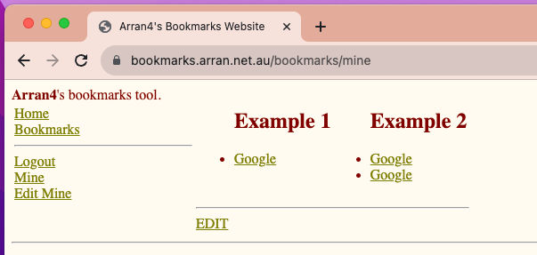
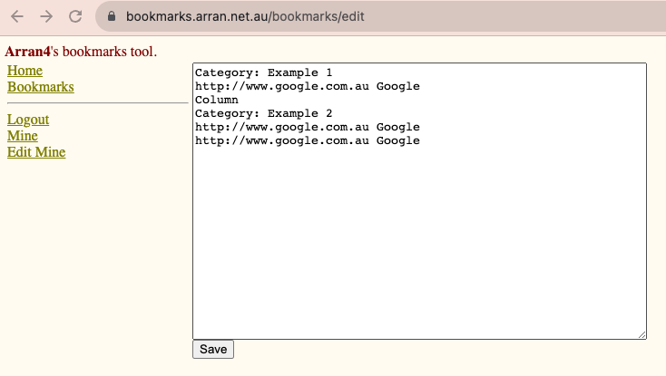

# goa4web-bookmarks

Goa4webb-ookmarks is a Spin out from [goa4web](https://github.com/arran4/goa4web/), which is a chatGPT aided 
(with slight enhancement) conversion of [a4web](https://github.com/arran4/a4web/) (a c++ website I made while in 
university in 2005-6) into go.

This project isn't designed to be used directly. Feel free to fork, copy, or submit PRs if you wish to use it for 
yourself.

There will be a blog post on this and the related tech, log an issue if I fail to update this with it.

# What it does

The purpose of this component of the website was to allow users to create a list of links they would be able to use
as soon as they opened their browser. The idea was that users would set it as their "Home Page". This was of course
written instead of using [iGoogle](https://en.wikipedia.org/wiki/IGoogle), or before Google Chrome started pushing 
"search as the home page."

It allowed you to provide a list of categorized links as such:



It supported columns and categories in a simplistic way:



You require a category for any links. So in the language (new errors could exist b/c chatgpt did the conversion:) 
```
Category: <Category Name>
```

Then each link provided in:
```
<link> <Text>
```
Format. Where the dividor is the first ` ` (space) character.

To create a new column use:
```
Column
```

Such as a complete config could look like:
```
Category: Example 1
http://www.google.com.au Google
Column
Category: Example 2
http://www.google.com.au Google
http://www.google.com.au Google
```

A video of use:


# Tech

It uses Google Oauth2 for authentication, and either SQLite or Mysql for the backend.

It has its own configuration file format in it, which isn't being used. Future expansion could be to use that so 
the properties don't have to be passed around using environment variables.

As it uses CGo because of sqlite there is a bit of effort required for new compile targets, they can be provided
upon request.

# Installation

Currently, it's built and packaged using goreleaser, and a docker container. The docker container version is the only
version which is configured to start, if you install it using the .deb, or .rpm you will have to provide the environment
variables yourself.

The docker container is available in ghcr.io:
* https://github.com/arran4/goa4web-bookmarks/pkgs/container/goa4web-bookmarks

You can get the binaries directly from the release tag:
* https://github.com/arran4/goa4web-bookmarks/releases/tag/v1.0.0

## Configuration

Runtime settings are loaded from an environment file and an optional JSON configuration file.
By default the server reads `/etc/goa4web-bookmarks/goa4web-bookmarks.env` and
`/etc/goa4web-bookmarks/config.json`. The paths can be overridden with the
`GOBM_ENV_FILE` and `GOBM_CONFIG_FILE` environment variables or the `-config` command line flag.

`example-config.json` and `example.env` in the repository show the expected format.

Database settings are controlled by `DB_CONNECTION_PROVIDER` and `DB_CONNECTION_STRING`.
Other options include OAuth2 endpoints and credentials, site title, namespace, whether CSS
columns are enabled, favicon cache directory and size, and a flag to hide the footer.

If OAuth2 URLs are not provided the Google endpoints are used by default.

## Running with Docker

The Docker image now uses an Alpine base image. Run it with the required
database environment variables:

```
docker build -t goa4web-bookmarks .
docker run -p 8080:8080 -p 8443:8443 \ 
  -v $(pwd)/data:/data \
  -e DB_CONNECTION_PROVIDER=sqlite3 \
  -e DB_CONNECTION_STRING='file:/data/a4webbookmarks.db?_loc=auto' \
  goa4web-bookmarks
```

# Motivation:

See: https://open.substack.com/pub/arranubels/p/quicklinks?r=1ner06&utm_campaign=post&utm_medium=web
